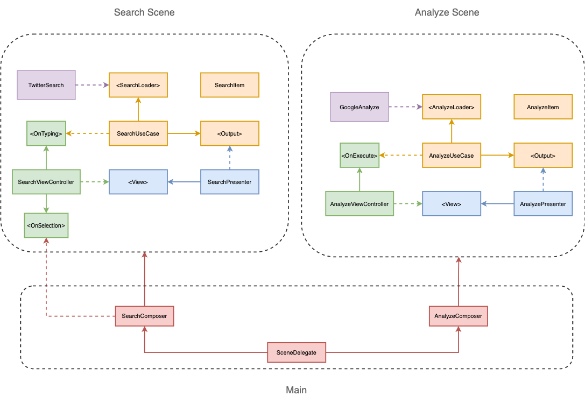

# Sentimentify,  the app who analyze your tweets :)

The architecture was built using the concepts of Clean Architecture and the SOLID principles. The modularization was composed by:
- [SentimentifyEngine](./SentimentifyEngine/SentimentifyEngine): Domain and presentation layers of Search and Analyze features plus abstractions of data layer, like HTTP client. 
- [SentimentifyiOS](./SentimentifyEngine/SentimentifyiOS): User interface implementation of Search and Analyze features using UIKit.
- [TwitterSearchInfrastructure](./SentimentifyEngine/TwitterSearchInfrastructure): Infrastructure details of how to do a twitter request, how authenticate and how map the data.
Implements the [SearchLoader](./SentimentifyEngine/SentimentifyEngine/Search%20Domain/SearchLoader.swift) protocol and add behaviour of tweets search.
- [GoogleAnalyzeInfrastructure](./SentimentifyEngine/GoogleAnalyzeInfrastructure): Infrastructure details of how to do a natural language request, how authenticate and how map the data.
Implements both [AnalyzeLoader](./SentimentifyEngine/SentimentifyEngine/Analyze%20Domain/AnalyzeLoader.swift) and [AnalyzeClassifier](./SentimentifyEngine/SentimentifyEngine/Analyze%20Domain/AnalyzeClassifier.swift) protocol, and add behaviour of analyze sentiment and classify the content.
- [SentimentifyTestExtensions](./SentimentifyEngine/SentimentifyTestExtensions): Add extra behaviours specific for unit tests.
- [SentimentifyApp](./SentimentifyApp/SentimentifyApp): The main module, that create features and inject the dependencies, control the navigation flow, add new behaviours trough decorators and adapters.

https://user-images.githubusercontent.com/6041775/116122698-82862000-a698-11eb-8d7f-ae130b6a2098.mov

## Features

- Search and list the latest tweets
- See the emotion result based on selected tweet

## Non-functional features

- Clean Architecture
- SOLID Principles
- Unit Tests using TDD
- Modular projects using Frameworks
- Design Patterns (Strategy, Proxy, Decorator and Adapter)
- Twitter and Google Natural Language as infrastrucure details, adding the possibility to extend new behaviours
- UITableViewDiffableDataSource
- Child View Controllers (Plugin like)
- Dark Mode
- HTTP requests
- Error Handling
- CI using GitHub Actions
- Swift Package Manager

## Third-party dependencies
- Kingfisher

## Architecture Diagram

